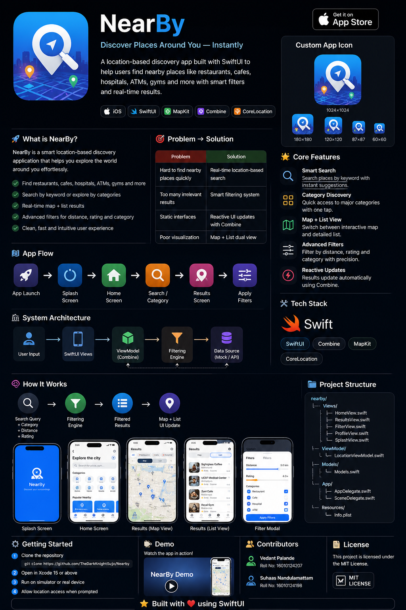

# 📍 NearBy  

### ⚡ Discover Places Around You — Instantly

<p align="center">
  
  
  
</p>

<p align="center">
  <b>Smart location-based discovery with real-time filtering and seamless UI</b>
</p>

---

## 🚀 What is NearBy?

**NearBy** is a **location-based discovery app** that helps users instantly find:

- 🍽️ Restaurants  
- ☕ Cafes  
- 🏥 Hospitals  
- 🏧 ATMs  
- 🏋️ Gyms  
- 🌳 Parks  

👉 Built for **fast, intuitive, real-time exploration**

---

## 🧠 Core Idea

> Convert **user intent + location → meaningful results**

- 🔍 Search  
- 🎛️ Filter  
- 📍 Discover  

Fully reactive — no manual refresh required.

---

## 🎯 Problem → Solution

| Problem                      | Solution           |
|----------------------------|-------------------|
| Hard to find nearby places | Real-time search  |
| Irrelevant results         | Smart filtering   |
| Static UI                  | Reactive updates  |
| Poor UX                    | Map + List views  |

---

## 🧩 Core Features

### 🔍 Smart Search
- Keyword-based search  
- Instant suggestions  

### 📂 Category Discovery
- Restaurant, Cafe, Hospital, ATM, Gym, Park  
- One-tap filtering  

### 🗺️ Map + List View
- Interactive MapKit  
- Toggle between map & list  

### 🎛️ Advanced Filters
- Distance slider  
- Rating filter  
- Category filter  

### ⚡ Reactive System
- Built using **Combine**
- Updates automatically on:
  - search  
  - filters  
  - category  

---
## 🎨 App Overview

<p align="center">
  
</p>

---

## 🎬 App Flow

```mermaid
flowchart TD
A[App Launch] --> B[Splash Screen]
B --> C[Home Screen]
C --> D[Search or Category]
D --> E[Results Screen]
E --> F[Apply Filters]
F --> E
````

---

## 🏗️ System Architecture

```mermaid
flowchart LR
A[User Input] --> B[SwiftUI Views]
B --> C[ViewModel]
C --> D[Filtering Logic]
D --> E[Data Source]
E --> C
C --> B
```

---

## 🧠 How It Works

```text
Search + Category + Distance + Rating
            ↓
     Filtering Engine
            ↓
     Filtered Results
            ↓
   Map + List UI Update
```

---

## 📱 Key Screens

* Splash Screen
* Home Screen
* Results (Map + List)
* Filter Modal
* Profile

---

## 🛠️ Tech Stack

<p align="center">
  
</p>

### Mobile

* SwiftUI
* Combine

### APIs

* CoreLocation
* MapKit

---

## 📂 Project Structure

```bash
nearby/
│── Views/
│   ├── HomeView.swift
│   ├── ResultsView.swift
│   ├── FilterView.swift
│   ├── ProfileView.swift
│   ├── SplashView.swift
│
│── ViewModel/
│   └── LocationViewModel.swift
│
│── Models/
│   └── Models.swift
```

---

## 🚀 Getting Started

1. Clone the repository
2. Open in Xcode
3. Run on simulator or device
4. Allow location access

---

## ✨ Engineering Highlights

* Reactive filtering using Combine
* Map integration with annotations
* Dynamic filtering system
* Smooth SwiftUI navigation
* Clean MVVM architecture

---

## 🔮 Future Enhancements

* 🌐 Google Places API integration
* 📍 Live GPS tracking
* ❤️ Favorites system
* ⭐ Reviews & ratings
* 🔐 Authentication
* ☁️ Cloud sync

---

## 💬 Key Insight

> This is not just a UI app —
> it is a **real-time location intelligence system**

---

## 👨‍💻 Contributors

* Vedant Palande
* Suhaas Nandulamattam

---

## 📄 License

MIT License
